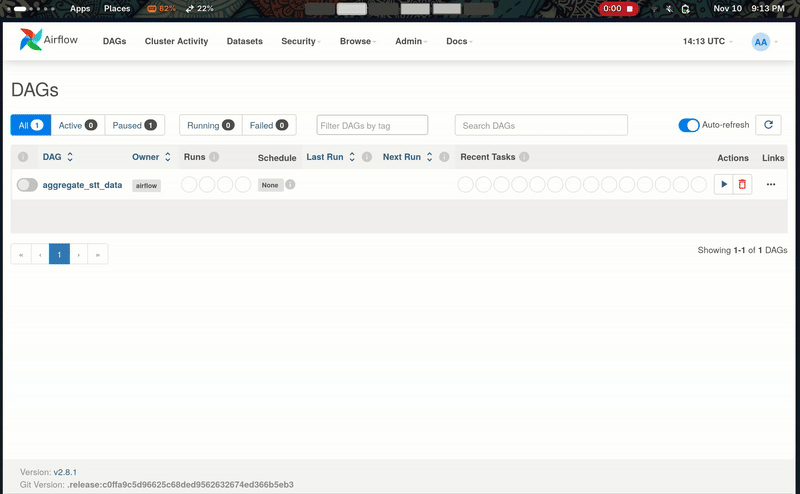

# Airflow Project - Aggregate STT Data

## Setup

### 1. Get Docker

This project is based on a dockerized airflow. To install docker compose on your operating system, [click here to refer to Docker's official site.](https://docs.docker.com/compose/install/)

### 2. Set up Airflow

* For linux operating systems (can skip on mac/windows), need to first run these commands below
```bash
mkdir -p ./dags ./logs ./plugins ./config
echo -e "AIRFLOW_UID=$(id -u)" > .env
```

* Get your airflow running with docker compose with:
```bash
docker compose up
```
or, depending on which version of docker you have, it might be:
```bash
docker-compose up
```
* Wait for the initialization to finish, and login to [localhost:8080](http://localhost:8080) with:

  * user: airflow
  * password: airflow

## Run the DAG
* The DAG is not scheduled. To trigger it manually, hit the trigger button next to the DAG, as below

* The tasks will create a new file as data/STT_AGGREGATED.csv which contains the result based on the requirements of this task.
